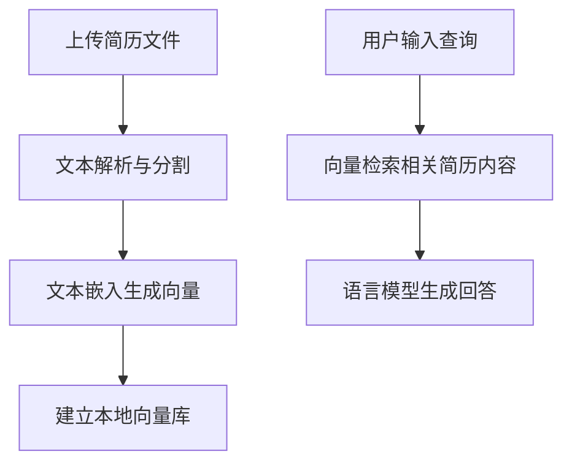

# 简历整合智能体

## 项目简介
本项目打造一个多功能智能体，整合了**本地简历问答**、**留学规划咨询**和**简历自动生成**三大核心功能，帮助用户高效管理简历信息、规划留学路径及自动生成标准简历文件。

---

## 功能模块

### 1. 本地简历问答
- **支持格式**：PDF、TXT简历材料格式文件上传
- **功能说明**：
  - 上传本地简历材料后，智能体将对内容进行解析和向量化
  - 用户通过自然语言提问，系统基于简历内容进行精准回答
  - 支持本地对话记忆，支持多轮问答，深化对简历细节的理解

### 2. 留学规划咨询
- **咨询范围**：
  - 留学申请流程与材料准备
  - 专业选择及院校推荐
  - 留学生活及适应指导
- **交互方式**：
  - 采用大语言模型对话，支持多轮交互
  - 根据用户输入的背景信息和目标，提供个性化建议

### 3. 简历自动生成
- **输入**：用户填写个人信息、教育背景、项目经历等
- **输出**：生成符合行业规范的简历文档（PDF/DOCX）
- **特色**：
  - 自动排版，支持一键导出

---

## 技术栈

| 功能         | 技术选型                         |
| ------------ | -------------------------------- |
| 文档解析     | LangChain 文档加载器（PyPDFLoader、文本加载） |
| 向量数据库   | Chroma                   |
| 文本嵌入     | sentence-transformers/all-MiniLM-L6-v2 |
| 语言模型     | Deepseek R1    |
| 简历生成     | Jinja2 模板引擎 + WeasyPrint |
| 前端界面     | Streamlit                       |
| 数据存储     | CSV        |

---

## 项目流程示意



---

# 使用说明

## 运行项目

1. 打开终端（Terminal 或 CMD），进入项目目录：
   ```bash
   cd project1
2.启动streamlit应用
     ```bash
   streamlit run interface.py

## 联系方式
- 项目负责人：陈博阳
- 邮箱：1175716776@qq.com
- GitHub：https://github.com/AhriOR
